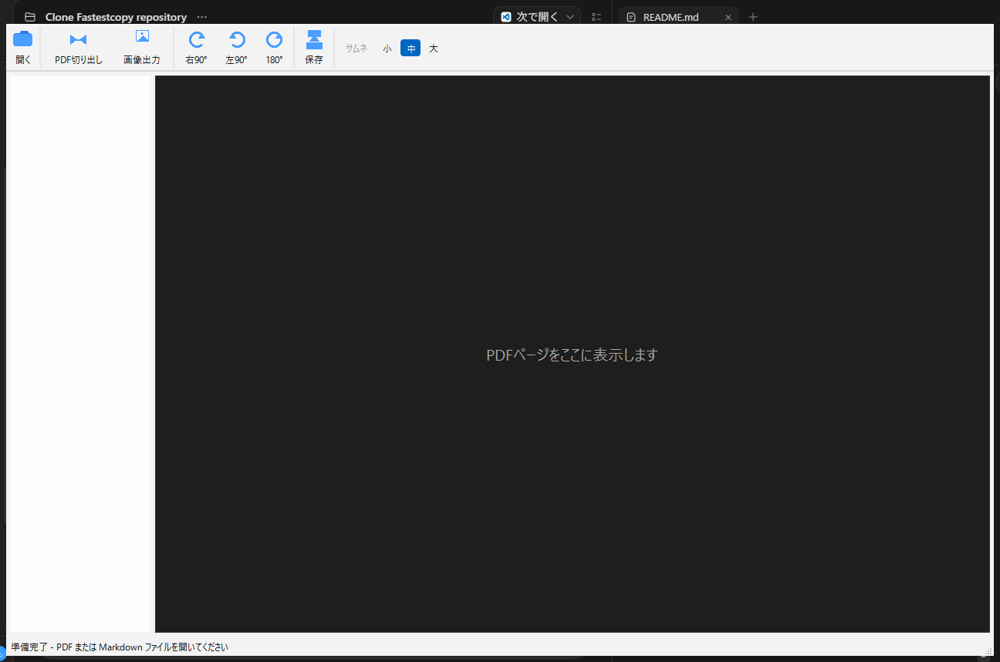

# QuickMarkPDF
[日本語版 README_jp.md](README_jp.md)

<p align="center">
  
</p>

A simple Windows desktop PDF page editor — free, no ads, no donation requests, no paid features. Just the split / merge / reorder / rotate / export you actually need. As a bonus, it also renders and exports Markdown to PDF, with Mermaid diagrams and math (MathJax).

**Current version: v1.1.0.** `core/native/` (C++17 + WebView2) is the shipped product. `python/prototype/` (PySide6) is a development-time evaluation prototype and is not distributed. See [`document/about.md`](document/about.md) and [`document/environment.md`](document/environment.md).

The UI is Japanese-only; there is no language toggle. The English and Japanese README screenshots are the same window.

## Features

- Open, combine, split, reorder, and rotate PDF pages
- Drag-and-drop page reordering, including moving pages between files
- Export selected/all pages to PDF (split) or PNG/JPEG (DPI, quality, and crop)
- Undo and unsaved-change protection
- Markdown preview with Mermaid diagrams and math, exportable to PDF

## Using the binary release

If you only want to run the app, download the ZIP from GitHub Releases. GitHub Actions builds `QuickMarkPDF-binary.zip` on a `v*` tag; the ZIP is not stored in this repository.

- [Latest releases](https://github.com/maktak-105/QuickMarkPDF/releases)
- [QuickMarkPDF v1.1.0](https://github.com/maktak-105/QuickMarkPDF/releases/tag/v1.1.0)
- [Direct download of QuickMarkPDF-binary.zip](https://github.com/maktak-105/QuickMarkPDF/releases/download/v1.1.0/QuickMarkPDF-binary.zip)

The ZIP contains all distribution files in one flat folder (`vendor/` stays next to `index.html`).

- `QuickMarkPDF.exe` - GUI version (the shipped app)
- `QuickMarkPDF_cli.exe` - lightweight non-GUI demo binary (not a product CLI)
- `pdfium.dll` - PDF rendering/editing engine
- `WebView2Loader.dll` - WebView2 loader
- `index.html` - bundled GUI
- `vendor/` - Mermaid.js and MathJax used by Markdown preview
- `readme.txt` / `readme_jp.txt` - distribution documentation
- `history.txt` / `history_jp.txt` - change log
- `LICENSE.txt` / `LICENSE_jp.txt` - MIT License files

Release binaries and checksums are published on GitHub Releases, not in this repository.

Run `QuickMarkPDF.exe` for the GUI. Keep `QuickMarkPDF.exe`, `pdfium.dll`, `WebView2Loader.dll`, `index.html`, and `vendor/` in the same folder. If WebView2 Runtime is unavailable, install Microsoft Edge WebView2 Runtime (Evergreen). It is normally included with Windows 11, but may require installation on older Windows 10 systems, LTSC, Server, or managed devices.

## GUI usage

1. Click **開く** (Open) to load one or more PDFs, or a single Markdown (`.md`) file. PDF and Markdown cannot be mixed in one selection.
2. Select pages in the left thumbnail panel (click / Ctrl+click / Shift+click). Drag thumbnails to reorder, including across files.
3. Rotate, delete, split to a new PDF, or export images from the toolbar or the right-click menu.
4. **Save** with one PDF open can overwrite or save as. With multiple PDFs open, Save always uses Save As and merges every open file's pages into one new PDF (originals are left unmodified). That is also how you merge PDFs.
5. Opening a `.md` file switches to Markdown preview (Mermaid and MathJax work offline). Save then exports the preview to PDF.
6. **ヘルプ** (Help) has a usage guide and keyboard shortcuts; **設定** (Settings) controls preview wheel mode.

Keyboard shortcuts: `Ctrl+O` open, `Delete` delete selected pages, `Ctrl+Z` undo, `Ctrl+S` save.

Full usage, including password-protected PDFs and image-export options, is in [`dist/documents/readme.txt`](dist/documents/readme.txt).

## CLI

`QuickMarkPDF_cli.exe` is a page-model demo used to exercise the native engine. It is not a product command-line interface.

```powershell
.\QuickMarkPDF_cli.exe --help
.\QuickMarkPDF_cli.exe demo
```

## Building the native version

The native build uses the MinGW-w64 C++ toolchain, validated with WinLibs (MCF threads, UCRT runtime):

```powershell
winget install --id BrechtSanders.WinLibs.MCF.UCRT --exact --source winget
```

`build_native.py` automatically searches the standard WinGet package location and also looks for `windres.exe` next to the detected compiler, so adding MinGW to `PATH` is not required for the project build.

The WebView2 SDK and PDFium are fetched into `third_party/` (gitignored):

```powershell
powershell -File scripts\fetch_webview2_sdk.ps1
powershell -File scripts\fetch_pdfium.ps1
python build_native.py
```

Output under `dist/binary/`: `QuickMarkPDF.exe`, `QuickMarkPDF_cli.exe`, `pdfium.dll`, `WebView2Loader.dll`, bundled `index.html`, and `vendor/`.

Full development details, tests, and QA: [`document/environment.md`](document/environment.md). Specification: [`document/spec.md`](document/spec.md).

## Evaluation prototype (Python)

The PySide6 prototype is not the shipped app. It remains in the tree so page-editing behavior can still be compared during development.

```powershell
python -m venv .venv
.venv\Scripts\activate
python -m pip install -r requirements.txt
python python/prototype/main.py
```

## License

This project is provided under the MIT License.

`Copyright (c) 2026 maktak-105 (GitHub: https://github.com/maktak-105)`

See [`dist/documents/LICENSE.txt`](dist/documents/LICENSE.txt) for the English original and [`dist/documents/LICENSE_jp.txt`](dist/documents/LICENSE_jp.txt) for the Japanese reference translation.

## Third-party software

The shipped GUI redistributes:

- **PDFium** (`pdfium.dll`) — see `third_party/pdfium/LICENSE` and `third_party/pdfium/licenses/`
- **Microsoft WebView2 Loader** (`WebView2Loader.dll`) — Microsoft's license in `third_party/webview2/LICENSE.txt`
- **Mermaid.js** — MIT (`resources/vendor/mermaid/LICENSE`)
- **MathJax** — Apache License 2.0 (`resources/vendor/mathjax/LICENSE`)

WebView2 Runtime is not bundled; it is part of Windows 11 (and many Windows 10 systems) or installed separately.

## Disclaimer

This software is provided as-is. The author assumes no responsibility for data loss, system failures, or hardware damage. Always back up important PDFs before editing or exporting them.

QuickMarkPDF is independent software and is not affiliated with or endorsed by Adobe, Microsoft, or any other third-party software vendor.

## Design Philosophy

Most PDF tools online are either ad-funded viewers that push a paid tier, or full document suites with far more surface area than a quick "cut a few pages out and rotate this one" task needs. QuickMarkPDF exists to be the small, dependable tool for that instead:

- **Page editing that stays direct and visible**: select pages, drag to reorder, rotate, cut out — no hidden project files, no multi-step wizards for a two-click task.
- **Free. No ads, no donation requests, no paid features, no telemetry**: it does what it says and gets out of the way.
- **Markdown-to-PDF as a bonus, not the point**: bundling Mermaid/MathJax support means notes with diagrams and formulas convert cleanly, without needing a second tool.
