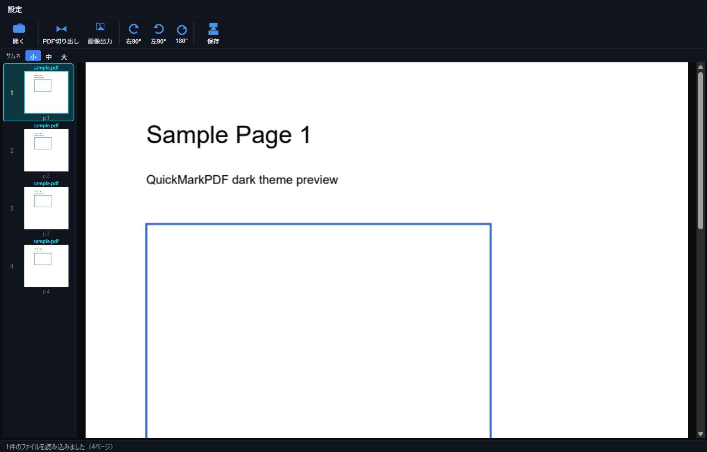

# QuickMarkPDF
[English README.md](README.md)

<p align="center">
  
</p>

広告も寄付要求もない、シンプルなWindowsデスクトップ向けPDFページ編集ツールです。分割・結合・並べ替え・回転・書き出しといった、必要最小限の編集に絞っています。おまけとして、Markdown（Mermaid図・数式（MathJax）対応）のプレビュー・PDF書き出しも備えています。

**`core/native/`（C++17 + WebView2版）が製品として出荷される版です。** `python/`（PySide6版）は開発中の挙動評価に使う試作・評価用プロトタイプであり、配布はされません。詳細な位置づけ・経緯は[`document/about_jp.md`](document/about_jp.md)・[`document/environment_jp.md`](document/environment_jp.md)を参照してください。

## 主な機能

- 複数PDFの読み込み・連結・分割・並べ替え・回転
- サムネイルのドラッグ&ドロップによる並べ替え（複数ファイルをまたいだ移動も可）
- 選択/全ページをPDF切り出し、またはPNG/JPEG画像として書き出し（DPI・画質・クロップ範囲を指定可能）
- 元に戻す、未保存変更の確認保護
- Markdownプレビュー（Mermaid図・数式対応）、PDFへの書き出し

## 配布版を使う

現時点ではGitHub Releaseをまだ公開していません。下記のビルド手順に従ってソースからビルドしてください。リリース公開後、配布ZIPには以下が同梱される予定です。

- `QuickMarkPDF.exe` - GUI版
- `QuickMarkPDF_cli.exe` - 軽量な非GUIデモバイナリ（製品としての配布物ではありません）
- `pdfium.dll` - PDF描画・編集エンジン
- `WebView2Loader.dll` - WebView2接続用ローダー
- `index.html` - GUI本体（Mermaid/MathJaxを含む）
- `readme.txt` / `readme_jp.txt` - 使用説明書
- `history.txt` / `history_jp.txt` - 更新履歴
- `LICENSE.txt` / `LICENSE_jp.txt` - MIT License

GUI版は`QuickMarkPDF.exe`を実行します。WebView2 Runtimeがない場合は、Microsoft Edge WebView2 Runtime (Evergreen)をインストールしてください。Windows 11には通常含まれていますが、Windows 10の古い環境、LTSC、Server、管理端末では追加導入が必要な場合があります。

## ソースから起動する場合

```powershell
python -m venv .venv
.venv\Scripts\activate
python -m pip install -r requirements.txt
python python/main.py
```

上記のPython版は挙動評価用の試作品であり、製品版ではありません。製品版のビルド手順は下記「ネイティブ版のビルド」を参照してください。開発環境の詳細は[`document/environment_jp.md`](document/environment_jp.md)を参照してください。

## ネイティブ版のビルド

ネイティブ版はMinGW-w64のC++ツールチェーンを使用します。WinLibs（MCF threads、UCRT runtime）のWinGetパッケージで確認しています。

```powershell
winget install --id BrechtSanders.WinLibs.MCF.UCRT --exact --source winget
```

`build_native.py`は標準的なWinGetパッケージの場所を自動検索し、検出したコンパイラと同じフォルダの`windres.exe`も使うため、プロジェクトのビルドだけならPATH登録は不要です。

WebView2 SDKとPDFiumは`third_party/`（Git管理外）へ取得します。

```powershell
powershell -File scripts\fetch_webview2_sdk.ps1
powershell -File scripts\fetch_pdfium.ps1
python build_native.py
```

生成物: `dist/binary/QuickMarkPDF.exe`（`pdfium.dll`・`WebView2Loader.dll`・バンドル済み`index.html`も同時に生成）。

## ライセンス

MIT Licenseです。英語原文は[`dist/documents/LICENSE.txt`](dist/documents/LICENSE.txt)、日本語参考訳は[`dist/documents/LICENSE_jp.txt`](dist/documents/LICENSE_jp.txt)を確認してください。

## 注意事項

本ソフトウェアは現状有姿で提供されます。本ソフトウェアの使用、データ消失、システム障害、ハードウェア故障などについて作者は責任を負いません。重要なPDFは必ずバックアップしてから編集・書き出ししてください。

## 設計思想

世の中のPDFツールの多くは、広告収益前提の閲覧ソフト（有料版への誘導つき）か、逆に「数ページ切り出して1枚だけ回転したい」程度の作業には過剰な、機能てんこ盛りの文書統合スイートのどちらかに寄りがちです。QuickMarkPDFは、その中間を埋める小さく堅実なツールを目指しています。

- **ページ編集を直接的で分かりやすい操作にする**: 選択してドラッグで並べ替え、回転、切り出し——2クリックで済む作業に隠しプロジェクトファイルや多段ウィザードは要りません。
- **広告・寄付要求・テレメトリなし**: やるべきことをやって、余計な自己主張はしません。
- **Markdown→PDFはあくまでおまけ**: Mermaid/MathJaxを同梱することで、図や数式を含むメモも別ツールを用意せずそのままPDF化できます。
