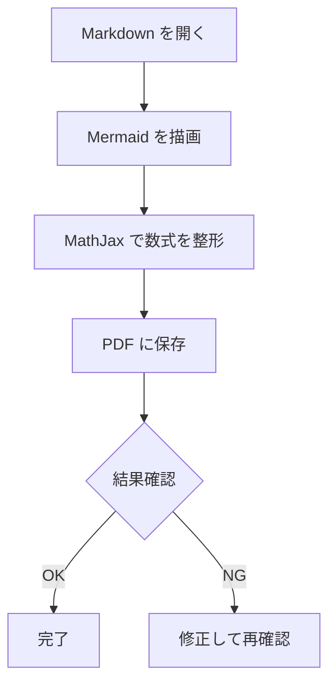
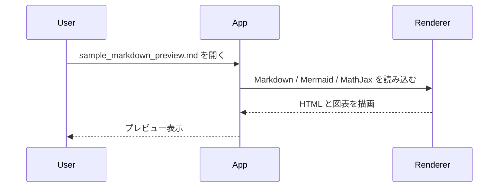

# Markdown Preview Sample

このファイルは、QuickMarkPDF の Markdown 表示モードで次の要素を確認するためのサンプルです。

- Mermaid 図表
- インライン数式
- ブロック数式
- 表
- コードブロック

## Mermaid Flowchart



## Mermaid Sequence Diagram



## Inline Math

インライン数式の例:

- ピタゴラスの定理: $a^2 + b^2 = c^2$
- ガウス分布: $f(x) = \frac{1}{\sigma\sqrt{2\pi}} e^{-\frac{(x-\mu)^2}{2\sigma^2}}$
- オイラーの等式: $e^{i\pi} + 1 = 0$

## Block Math

二次方程式の解:

$$
x = \frac{-b \pm \sqrt{b^2 - 4ac}}{2a}
$$

フーリエ変換:

$$
\mathcal{F}\{f(t)\}(\omega) =
\int_{-\infty}^{\infty} f(t)e^{-i\omega t}\,dt
$$

行列の例:

$$
A =
\begin{bmatrix}
1 & 2 & 3 \\
0 & 1 & 4 \\
5 & 6 & 0
\end{bmatrix}
$$

## Table

| 項目 | 内容 | 確認ポイント |
| --- | --- | --- |
| Mermaid | フローチャート / シーケンス図 | 図として表示されるか |
| Math | インライン / ブロック数式 | 記号崩れなく描画されるか |
| PDF保存 | 表示内容の出力 | 画面どおり保存されるか |

## Code Block

```python
def quadratic_roots(a, b, c):
    disc = b**2 - 4*a*c
    return (
        (-b + disc**0.5) / (2*a),
        (-b - disc**0.5) / (2*a),
    )
```

## Checklist

1. このファイルをアプリで開く
2. Mermaid 図表が図として見えるか確認する
3. 数式が TeX 記法のままではなく整形表示されるか確認する
4. `保存` から PDF に出力する
5. 出力 PDF に図表と数式が含まれているか確認する
